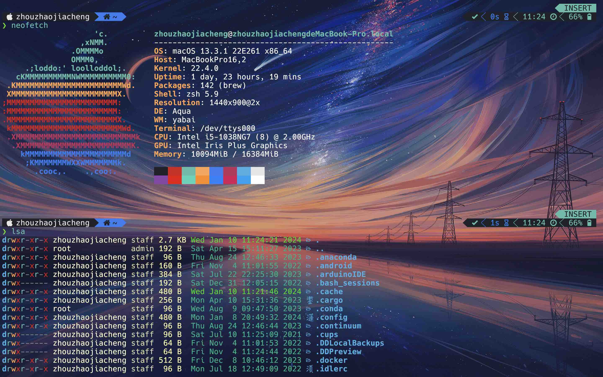

# Beautify_Terminal

This repo includes a simple introduction about how to beautify your terminal.

## Demo

Here is a simple demo for configuration.



## Organization

The file organization of this repo is shown as follow

```zsh
.
├── 'Keyboard Shortcuts'
│   └──  'Windows Terminal.md'
├── outline.md
├── plug_mgr.md
├── README.md
├── tty.md
├── win_conf
│   ├── 'oh-my-posh for Windows'
│   │   ├── 'Part 1 - Introduction and Installation.md'
│   │   ├── 'Part 2 - Font.md'
│   │   ├── 'Part 3 - Changing Prompt.md'
│   │   ├── 'Part 4 - Theme.md'
│   │   ├── 'Part5 - Advanced.md'
│   │   └── sample_profile.txt
│   └── 'Windows Terminal Config Guide.md'
└── wsl_conf
    ├── Part1.Installation.md
    ├── Part2.oh_my_zsh.md
    ├── Part3.powerlevel10k.md
    └── Part4.keyboard_shortcut.md
```
