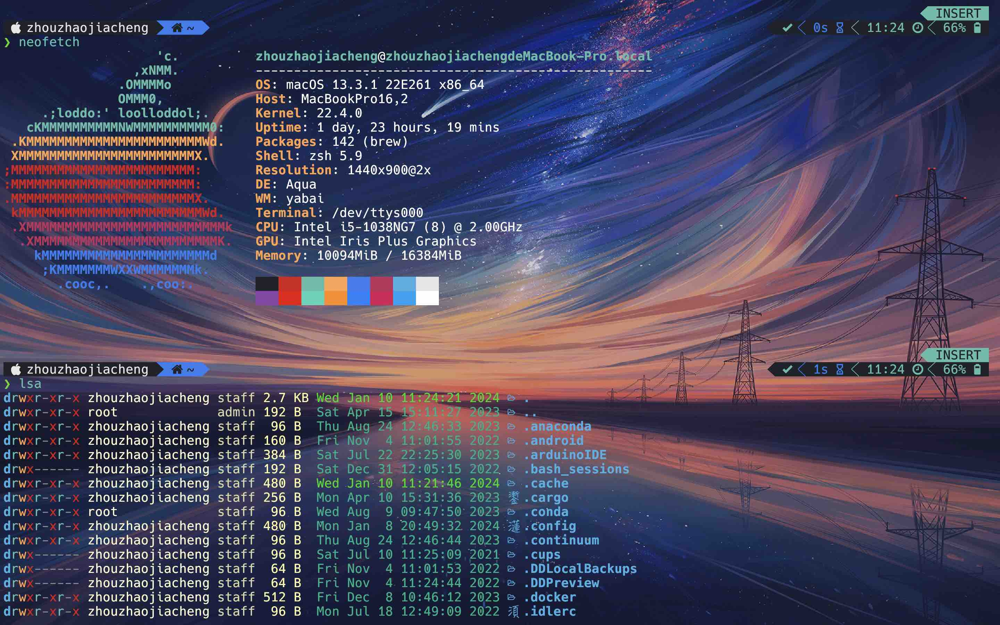

# Powerlevel10k settings

Powerlevel10k is a highly customizable theme of terminal. The official website is [here](https://github.com/romkatv/powerlevel10k).

## Install

See [here](https://github.com/romkatv/powerlevel10k?tab=readme-ov-file#installation)

You should also install `nerdfont` with your package manager. (macos user can use `homebrew` or `macport`) and set it to terminal font.

## Config

1. Run command `p10k configure` if it didn't run automatically.
2. Edit your `~/.p10k` according to the comment or search themes on the github.

You may need cheatsheet of [nerdfont](https://www.nerdfonts.com/)

Here are my configuration

