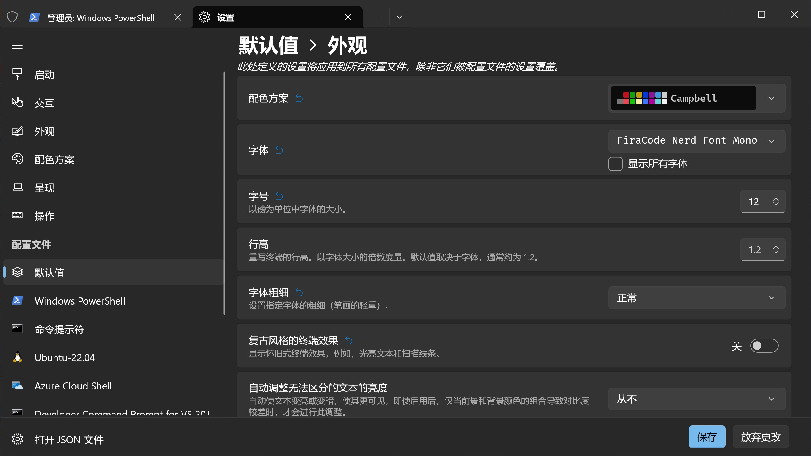
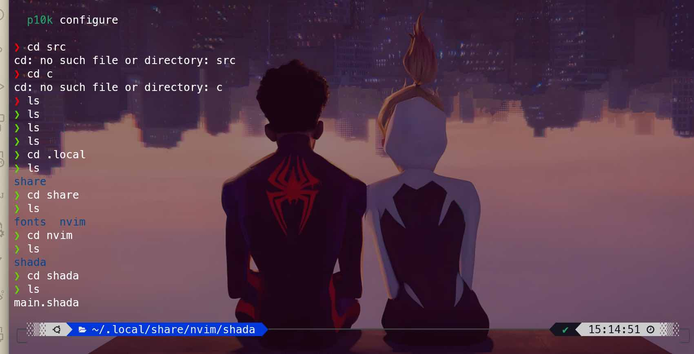

# Windows Terminal Config Guide

After everything with oh-my-posh is setup, your terminal may look something like this:


(This theme `neko` is provided by oh-my-posh, but I myself don't recommend using it in daily work. It's just too cute to be serious.)

Then you may want to go further and customize your own terminal. Here are some instructions.

You can go to this [link](https://zhuanlan.zhihu.com/p/435998754) for detailed instructions in Chinese.

## Before You Proceed

If you don't know what you're doing, please backup your `settings.json` file first, or try GUI setting in Windows Terminal. It can be accessed by `Ctrl + ,`, and it can provide all options written in this guide.



**It's more recommended for inexperienced users to use GUI settings.**

## Use AtlasEngine

AtlasEngine is a theme engine for Windows Terminal. It can be used to customize your terminal theme. It's recommended to use it with oh-my-posh.

In `settings.json`, add:

```json
"profiles":
{
    "defaults":
    {
        "useAtlasEngine": true
    }
}
```

## Background Image

Add to your `settings.json`:

```json
"profiles":
{
    "defaults":
    {
        "backgroundImage": "your_path/background.jpg",
        "backgroundImageOpacity": 0.5,
        "backgroundImageStretchMode": "uniformToFill"
    }
}
```

## Color Scheme

Change it in `settings.json`:

```json
"profiles":
{
    "defaults":
    {
        "colorScheme": "One Half Dark"
    }
}
```

## Transparency

Strongly recommended by @zzjc1234, you can add this to your `settings.json`:

```json
"profiles":
{
    "defaults":
    {
        "opacity": 80
    }
}
```

If you want your background be blurred, you can add:

```json
"profiles":
{
    "defaults":
    {
        "useAcrylic": true,
    }
}
```

## More Colors

Add to your `settings.json`:

```json
"profiles":
{
    "defaults":
    {
        "tabColor":"#E6FF00",
        "foreground":"#E6FF00",
        "background":"#000000",
    }
}
```

## Font

Add to your `settings.json`:

```json
"profiles":
{
    "defaults":
    {
        "font":
        {
            "face": "FiraCode Nerd Font Mono",
            "size": 12
        }
    }
}
```

## Result

The configuration of @mQzLjP:


