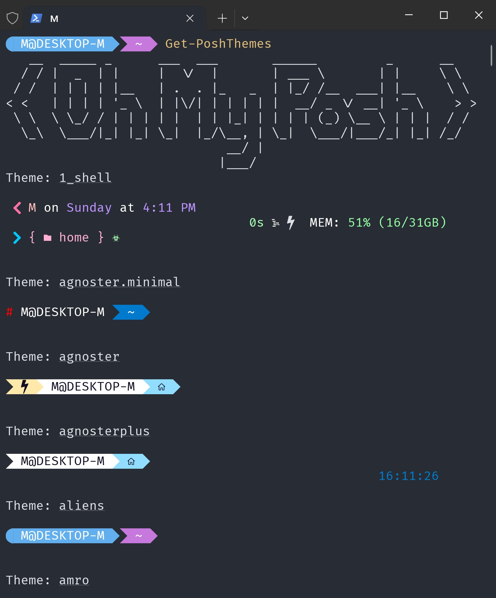

# oh-my-posh themes

You're free to use your own theme, see [Customize](https://ohmyposh.dev/docs/installation/customize) for more details.

Meanwhile, there're lots of themes for you to choose. Use `Get-PoshThemes` command in Powershell and pick one you like.



## Powershell

Change the line in `$PROFILE` in Part 3 to:

```powershell
oh-my-posh init pwsh --config 'your_path/your_theme.omp.json' | Invoke-Expression
```

## bash

Change the line in `.bashrc` in Part 3 to:

```bash
eval "$(oh-my-posh init bash --config your_path/your_theme.omp.json)"
```

**Note: Use `/` instead of `\` in the path.**
