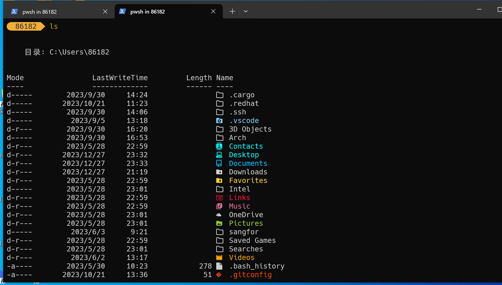

# Advanced settings for powershell

This part mainly focus on the advanced settings for powershell and help you to configure your `PROFILE`.

## Termination Icon

It is strongly recommended to install terminal-icons. Here is the demo



You can install this module with command `Install-Module -Name Terminal-Icons -Repository PSGallery` and add the following line to your `PROFILE`

```powershell
Import-Module -Name Terminal-Icons
```

## Auto completion

You can enable the auto completion of powershell by adding the following lines into your `PROFILE`

```powershell
Import-Module PSReadline
Set-PSReadLineOption -PredictionSource History
Set-PSReadLineOption -PredictionViewStyle ListView
Set-PSReadLineOption -EditMode Windows
```

For more advanced settgings in `PROFILE` like cmd completeing see [official document](https://learn.microsoft.com/zh-cn/powershell/module/psreadline/?view=powershell-7.4)

## Neofetch

As a tradition after beautifying your terminal or installing a system, you can run `neofetch` and take a screen shot and show it off in front of your friends. For windows, you can use your package mananger to install `neofetch` or use its alternative `screenfetch`.


