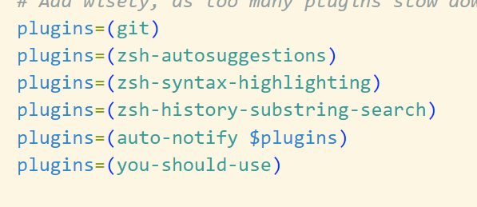

# Instruction for oh_my_zsh

## Introdution for oh_my_zsh

### What is oh_my_zsh?

Oh My Zsh is a delightful, open-source, community-driven framework for managing your Zsh configuration. It was created by Robby Russell in 20092 and has since been maintained by a team of volunteers.

### Why oh_my_zsh?

- Here are some key feature of oh my zsh:
  - **Plugins**: Many plugins.
  - **Themes**: 150 themes bundled.
  - **Auto-update tool**

- Disadvantages:
  - Not a plugin manager, but attains many plugin manager's features.
  - It is too large, sometimes cause slowness.

## Installation

- **Install git first**

```bash
sudo apt install git #deb
sudo pacman -S git #arch
```

- **Configure your git**

  You are strongly recommended to see [this](https://github.com/TechJI-2023/Basic_Git_wksp/blob/main/Setup_Github.md) if you didn't use git before.

- **Install oh my zsh**: Run the following command in your terminal

```bash
sh -c "$(curl -fsSL https://raw.githubusercontent.com/ohmyzsh/ohmyzsh/master/tools/install.sh)"
```

- Then press Y to switch your terminal to a zsh terminal.
  - Run this code to set zsh as default

    ```bash
    chsh -s /bin/zsh
    ```

- **auto-suggestion**:Run the following code

```bash
git clone https://github.com/zsh-users/zsh-autosuggestions.git $ZSH_CUSTOM/plugins/zsh-autosuggestions
```

- Note that for any plugins you add next, you need to go to the /home/your name/.zshrc file to add your plugins
  - Like this: plugins=(zsh-autosuggestions)

  - you can try to type a git in the terminal to check it out

- **syntax-highlighting**
  - give you highlight of syntax, red if incorrect and green if correct
  - type a word "git" to check it out

```bash
git clone https://github.com/zsh-users/zsh-syntax-highlighting.git $ZSH_CUSTOM/plugins/zsh-syntax-highlighting
```

- **history-substring-search**
  - type a git and use the up and down arrow to check it out.
  - to generate all the history command you have typed that contain the word "git".

```bash
git clone https://github.com/zsh-users/zsh-history-substring-search $ZSH_CUSTOM/plugins/zsh-history-substring-search
```

- **you-should-use**
  - It will give you hint about how to modify your command

```bash
git clone https://github.com/MichaelAquilina/zsh-you-should-use.git $ZSH_CUSTOM/plugins/you-should-use
```

- .zshrc

