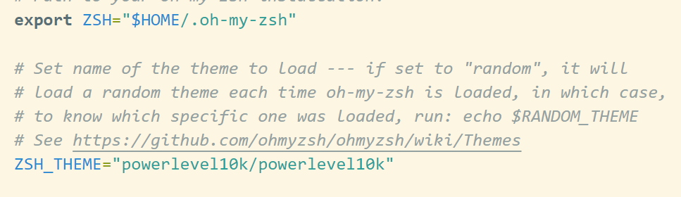
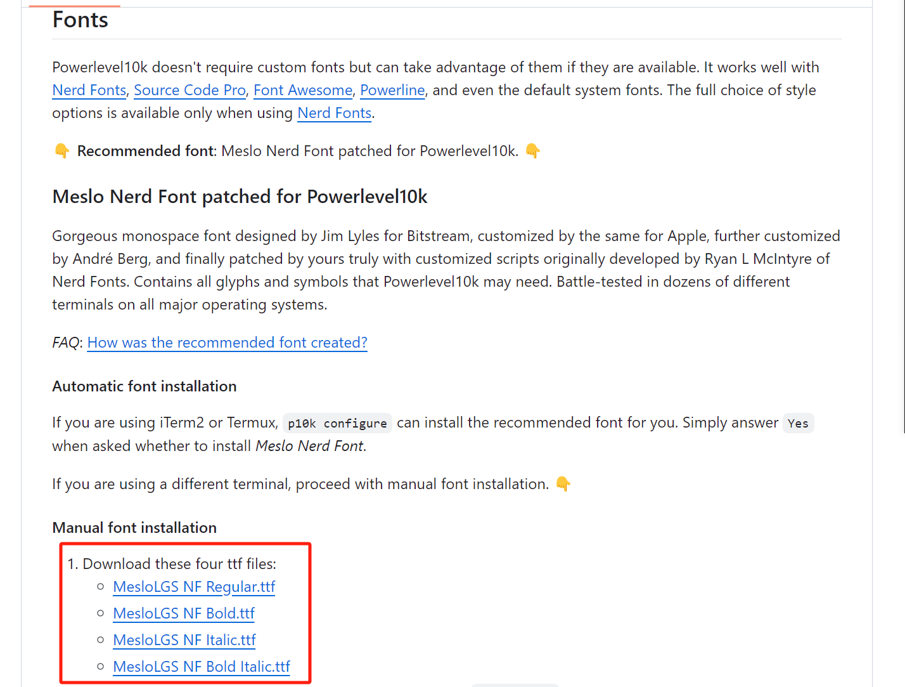
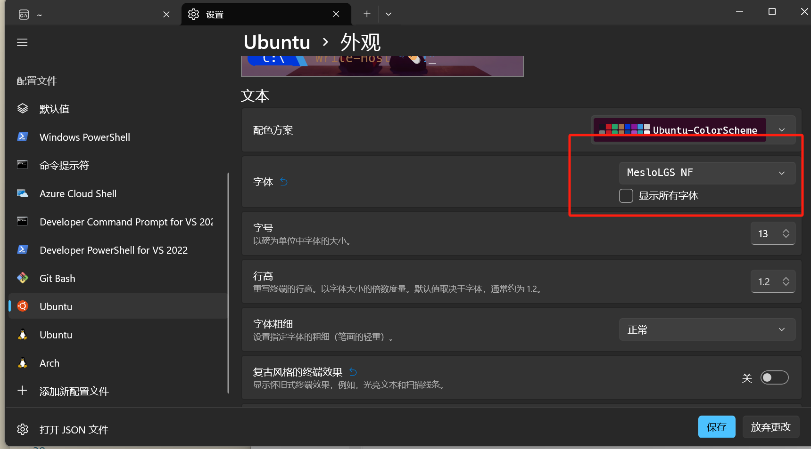
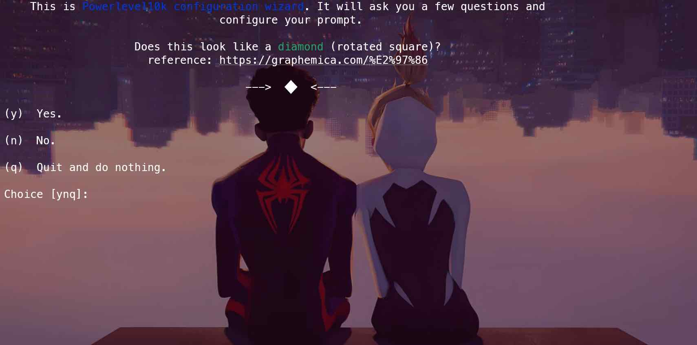
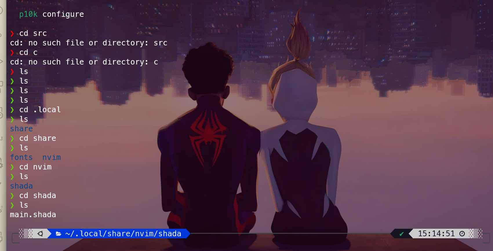

# About powerlevel10k

Powerlevel10k is a theme for Zsh. It emphasizes speed, flexibility, and out-of-the-box experience. Developed and maintained by romkatv on GitHub, it is one of the most versatile and powerful themes available for the popular zsh shell.

## Installation

```bash
git clone --depth=1 https://gitee.com/romkatv/powerlevel10k.git ${ZSH_CUSTOM:-$HOME/.oh-my-zsh/custom}/themes/powerlevel10k
```

Then change the ZSH_THEME="powerlevel10k/powerlevel10k" in the .zshrc file

like this:



Then type this in the terminal to set up your powerlevel10k **theme**

```bash
source ~/.zshrc
```

### Configuration

press 'q' first

#### Fonts

Note that we haven't download some of the fonts yet, so we may first go to the github website of [powerlevel10k](https://github.com/romkatv/powerlevel10k?tab=readme-ov-file)

Download one of the four fonts on the website



then move the file to the directory C:\Windows\Fonts

then set the new fonts in your ubuntu terminal, which is MesloLGS NF



type

```bash
p10k configure
```



to set up your own powerlevel10k theme!!!!

this is my personal result


